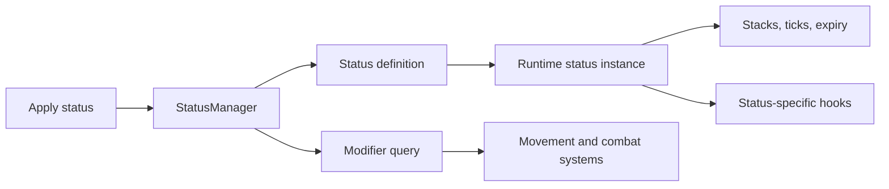

# Building a Runtime Status System for a Roguelite Combat Prototype

> Draft public case study copy. Do not publish until project permission and public attribution wording are approved.

## Summary

Tides of Eternity is an in-development Unity/C# roguelite project built by a rev-share team. I joined the project in July 2026 as the sole programmer currently working in the Unity repository. The project was already guided by an external game design document, so my work has focused on translating design intent into a playable combat prototype.

The strongest system I have built so far is the runtime status-effect architecture. The system supports data-configured modifiers, stacking behavior, duration and ticking, status-specific runtime hooks, and status conversions such as Chill becoming Freeze.

The core challenge was uncertainty. The GDD communicated the fantasy and high-level combat goals, but several mechanics still needed implementation details. I needed a system that could support current prototype behavior while staying flexible as design answers evolved.

## Technical Highlights

| Area | What I Built | Why It Matters |
| --- | --- | --- |
| Runtime Statuses | Statuses are active runtime instances rather than simple boolean flags. | Each status can own stack behavior, duration, ticking, expiration, and special-case hooks. |
| Data-Configured Modifiers | Status definitions expose movement, damage, crit, duration, and stacking values. | Combat tuning can evolve without hardcoding every value into movement or damage logic. |
| Shared Modifier Queries | Combat systems query aggregate status modifiers through `StatusManager`. | Movement and damage systems do not need one-off branches for every status. |
| Status Conversion | Chill can convert into Freeze when a configured stack threshold is reached. | The architecture supports interactions between status effects without turning each interaction into scattered combat code. |

## My Role

I built the Unity repository implementation for the current prototype. I did not write the GDD.

That distinction matters. This case study is about implementation: taking an external design source, identifying the missing technical questions, and building a combat-system foundation that could support the team’s evolving design.

The broader team includes artists, project managers, narrative contributors, and other non-programming roles. At the time of this draft, I am the only programmer/developer who has touched the project repo.

## The Problem

Status effects are central to the combat design. They are not just temporary labels on enemies; they affect movement, damage, critical values, stacking, timing, and interactions between different combat effects.

The hard part was that the GDD was not always implementation-complete. It could describe a mechanic in an evocative way, but that still left practical questions:

- What triggers the status?
- Does it stack?
- Does it refresh, extend, tick, expire, convert, or get consumed?
- Which values should be data-tuned?
- Which system owns the behavior?
- How should multiple statuses interact?

A simple flag-based implementation would have made the early prototype faster, but it would have pushed complexity into the wrong places. Movement, damage, enemies, and attacks would each need to know too much about every status.

I wanted the status system to own status behavior, and I wanted other combat systems to consume the results through a small, consistent interface.

## Approach

I split the system into three main layers:

1. `StatusManager` owns the active statuses on a combatant.
2. `StatusInstance` represents one active runtime status and owns stack/timing behavior.
3. `StatusEffectConfig` and `StatusDefinition` expose data-tuned values such as duration, stack rules, movement modifiers, damage modifiers, and crit modifiers.

The high-level flow is:



This lets a status behave like a small runtime object. A generic status can rely entirely on configured values. A more complex status can override hooks for behavior that needs code.

## Example: Chill Into Freeze

Chill is the clearest current demonstration because it is both visual and system-driven. In the combat playground, a dummy can be slowed by Chill and eventually frozen for 1.5 seconds.

The conversion logic is intentionally small:

```csharp
protected override void OnStackAdd(int stacks)
{
    if (Stacks == ((ChillStatusDefinition)Definition).chillToFreezeThreshold)
    {
        statusManager.ApplyStatus(StatusType.Freeze, Source);
    }
}
```

Chill does not directly control movement in this class. Instead, it applies Freeze when the configured threshold is reached. Freeze’s actual movement and damage behavior is handled through the shared status-definition and modifier path.

That separation is the important part. Status-specific code handles the interaction, while general combat systems still query movement and damage modifiers the same way.

## Modifier Aggregation

The most important architectural payoff is that systems like movement and damage do not need to hardcode every status effect. They can ask `StatusManager` for the current modifier relevant to their calculation.

For example, the status manager can aggregate modifiers for movement, incoming damage, outgoing damage, or critical values. Each active status contributes according to its configured stacking and modifier rules.

This means new status behavior can often be added by configuring a definition or adding a focused runtime status class, rather than spreading status checks throughout unrelated systems.

## Current Result

The current prototype supports:

- applying statuses to combatants;
- storing active statuses by type;
- adding stacks when statuses are reapplied;
- ticking and expiring statuses over time;
- consuming and removing stacks;
- runtime classes for statuses such as Chill, Daze, Disoriented, Doom, Freeze, Stagger, Surge, and Weak;
- modifier calculations for movement, damage, and critical values;
- visible status behavior in `CombatPlayground`, including Chill slowing a dummy and converting into Freeze.

This is still prototype work, but it gives the combat foundation a flexible status layer instead of a growing pile of one-off condition checks.

## Current Limitations

The system is not finished. Surge and consumed-on-hit behavior still need stronger integration with combat events. Some tuning values are prototype-level. Animation integration in the playground is serviceable but not final polish.

The project itself is also not a full roguelite vertical slice yet. Many larger GDD systems, including boons, room generation, boss encounters, hub progression, narrative systems, and the full weapon roster, are not implemented in the Unity prototype.

## What I Learned

This project changed how I think about game design documents.

A useful GDD needs both subjective direction and implementation-ready detail. The subjective layer matters because it tells the programmer what the mechanic should feel like. But when it is time to build the system, evocative wording has to become concrete behavior: triggers, values, stack rules, timing, ownership, and edge cases.

The status system was my answer to that ambiguity. Instead of waiting for every design answer or hardcoding each effect as a one-off, I built an architecture that could support the current prototype while leaving room for the design to keep evolving.

That is the kind of gameplay programming work I want to keep doing: translating mechanics into code, building flexible systems, and making design ideas testable in-game.

## Evidence Plan

- Code excerpts: `StatusManager`, `StatusInstance`, `StatusEffectConfig`, and `ChillStatusInstance`.
- Demo clip: Chill slowing a dummy and converting into Freeze.
- Diagram: status application -> runtime instance -> stacks/ticks -> modifier query -> movement/combat result.

