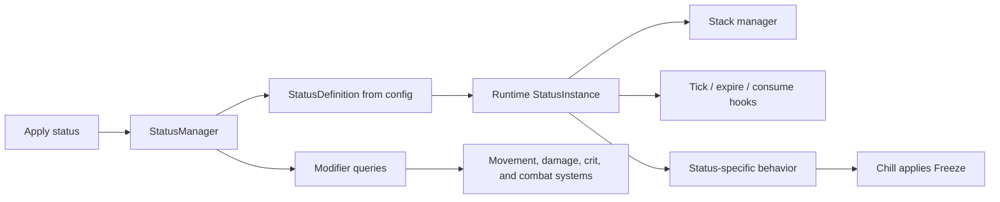

# Tides of Eternity - Status System Case Study

Working internal draft. Do not publish until permission is approved and public attribution language is confirmed.

## Working Title

Building a Flexible Runtime Status System from an External GDD

## 10-Second Summary

I joined a 14-person rev-share roguelite team as the sole programmer on the Unity repository and built the combat prototype foundation from an external GDD. The strongest current system is a runtime status-effect architecture that supports data-configured modifiers, stack behavior, duration/ticking, status-specific hooks, and conversions such as Chill becoming Freeze.

## Context

Tides of Eternity is a Unity/C# roguelite project being developed by a rev-share team. Wesley joined in July 2026, about three months after the project began, after seeing a call for gameplay programmers. The team includes artists, project managers, narrative contributors, and other non-programming roles; Wesley is currently the only developer/programmer who has touched the project repository.

The project was already guided by a large GDD when Wesley joined. Wesley did not write the GDD. The case study should therefore frame his work as implementing and prototyping systems from an external design source, not as authorship of the full design.

The current Unity project is a combat prototype, not a complete roguelite vertical slice. `CombatPlayground` can demonstrate movement, sword hits against a dummy, hit reactions, and status effects such as Chill, Daze, and Disoriented. The broader GDD includes many systems that are not implemented yet, including room generation, boons, bosses, hub progression, narrative systems, and a full weapon roster.

## Problem

The status system had to support a large combat design before every gameplay detail was finalized.

The GDD was useful for communicating fantasy and high-level intent, but some status descriptions were not implementation-complete. A line such as Doom shattering on chilled enemies is evocative, but a programmer still needs concrete answers:

- What exactly triggers the effect?
- Which object owns the behavior?
- How are stacks counted?
- Does the status tick, expire, convert, or get consumed?
- Which values are data-tuned?
- What happens when multiple statuses interact?

A naive implementation would have treated each status as a boolean flag or hardcoded branch inside damage, movement, and enemy logic. That would have worked for a small prototype, but it would become brittle once the team added more statuses, boons, weapons, enemy behaviors, and future design changes.

The core problem was therefore architectural: build a status system that could express current combat behavior while staying flexible enough for incomplete and evolving design answers.

## Constraints

- **Design:** The system had to implement an external GDD that mixed concrete numeric targets with still-evolving mechanics.
- **Scope:** The project was a combat prototype, so the status system needed to prove the foundation without pretending the full roguelite existed yet.
- **Team:** Wesley was the only programmer touching the repo, so the architecture needed to be understandable and maintainable by him as the system expanded.
- **Content:** Statuses needed data-facing configuration so future tuning did not require rewriting combat logic.
- **Presentation:** Public portfolio use requires permission, and public copy must not imply Wesley wrote the GDD.

## Approach

Wesley modeled statuses as runtime instances managed by a `StatusManager`, rather than as simple flags on a combatant.

At a high level, the system works like this:



`StatusManager` owns the active status dictionary, creates the correct runtime status class, emits applied/changed/removed events, and exposes a shared modifier query API. Other systems can ask for a movement or damage modifier without hardcoding every possible status.

`StatusInstance` owns the lifecycle of one active status: stack count, tick timing, expiration, and extension hooks such as `OnStackAdd`, `OnStackPop`, and `Tick`. Specialized statuses can override those hooks when they need custom behavior.

`StatusEffectConfig` and `StatusDefinition` provide the data-facing layer. Statuses can define stack mode, refresh behavior, max stacks, duration, tick interval, movement modifiers, incoming/outgoing damage modifiers, and critical modifiers.

## Key Code

The strongest code proof is the status-system excerpt package: [[Code Excerpts]].

The best public excerpt is likely `StatusManager.CalculateModifierFromStatuses()` because it shows the core architectural payoff: movement, damage, and crit systems can consume status effects through a shared modifier calculation instead of knowing about every status individually.

The best focused example is Chill:

```csharp
protected override void OnStackAdd(int stacks)
{
    if (Stacks == ((ChillStatusDefinition)Definition).chillToFreezeThreshold)
    {
        statusManager.ApplyStatus(StatusType.Freeze, Source);
    }
}
```

This is small, but it shows the shape of the architecture. Chill does not need to directly freeze movement in this class. Instead, it applies Freeze when the configured threshold is reached; Freeze's movement and damage behavior is handled by the shared status definition/modifier path.

## Solution

The current implementation supports:

- applying statuses to a combatant;
- storing active statuses by `StatusType`;
- adding stacks when a status is reapplied;
- ticking and expiring statuses over time;
- consuming or removing stacks;
- specialized runtime classes for statuses such as Chill, Daze, Disoriented, Doom, Freeze, Stagger, Surge, and Weak;
- modifier queries for movement, incoming damage, outgoing damage, incoming critical values, and outgoing critical values;
- status conversion examples such as Chill applying Freeze;
- a combat playground where dummies can receive statuses and visibly slow/freeze.

The result is a status layer that separates status ownership from the systems that consume status results. Movement and damage systems do not need separate branches for every status. They can query the current aggregate modifier and let the status system handle how that modifier was produced.

## Evidence

- Code excerpts: [[Code Excerpts]]
- Lead code files:
  - `C:\GameDev\Tides_of_Eternity\Tides_of_Eternity\Assets\Scripts\Combat\Statuses\StatusManager.cs`
  - `C:\GameDev\Tides_of_Eternity\Tides_of_Eternity\Assets\Scripts\Combat\Statuses\StatusInstance\StatusInstance.cs`
  - `C:\GameDev\Tides_of_Eternity\Tides_of_Eternity\Assets\Scripts\Combat\Statuses\StatusInstance\ChillStatusInstance.cs`
  - `C:\GameDev\Tides_of_Eternity\Tides_of_Eternity\Assets\Scripts\Combat\Statuses\StatusEffectConfig.cs`
- Visual asset assumed available from Wesley: Chill-to-Freeze demo clip.
- Supporting asset: status architecture diagram above.
- Evidence ledger: [[Evidence Ledger]]

## Current Limitations

This is still prototype work. It should not be presented as a finished combat system.

Known limitations:

- Surge and consumed-on-hit behavior still need stronger integration with combat events.
- Some status tuning is prototype-level.
- Animation integration in `CombatPlayground` is serviceable but not polished.
- The system exists inside a combat playground, not a full roguelite vertical slice.
- The project does not yet include many broader GDD systems such as boons, room generation, boss encounters, hub progression, or a full weapon roster.

## Reflection

This project taught a practical lesson about implementing from design documents: a GDD needs both subjective intent and implementation-ready clarity.

The subjective layer matters. Without knowing the game was aiming for a Hades-style isometric roguelite feel, it was harder to interpret the intended shape of the combat. But evocative design text alone is not enough to implement mechanics. A gameplay programmer also needs logistics: triggers, values, ownership boundaries, stacking rules, timing, edge cases, and how systems interact.

The status system is the strongest current example of Wesley responding to that ambiguity productively. Instead of waiting for every design answer or hardcoding each status as a one-off, he built a runtime architecture that could support current prototype needs while leaving room for later design clarification.

## What This Demonstrates

This case study demonstrates:

- gameplay systems implementation in Unity/C#;
- translating an external GDD into working runtime architecture;
- designing flexible systems for evolving combat rules;
- separating data/configuration from runtime behavior;
- building prototype foundations without overclaiming the full game scope;
- technical communication around what is implemented, what is provisional, and what still needs design clarification.

## Public Copy Guardrails

Do not imply:

- Wesley wrote the GDD.
- Tides is a complete roguelite or vertical slice.
- boons, room generation, bosses, hub progression, full weapon roster, or narrative systems are implemented.
- animation polish is final.
- every status is fully complete and wired into finished combat.
- the overall project is solo. The precise claim is that Wesley is currently the sole programmer/developer who has touched the repo.

## Next Draft Pass

1. Confirm permission and public attribution for the project/GDD.
2. Decide whether to name Kayra or describe the GDD as "external team-authored design documentation."
3. Insert or link the Chill-to-Freeze demo clip when available.
4. Choose the final public code excerpt length from [[Code Excerpts]].
5. Add a one-sentence project card summary for the homepage/projects index.

Public-facing draft: [[Case Study Public Draft]]
Short copy options: [[Short Copy]]
